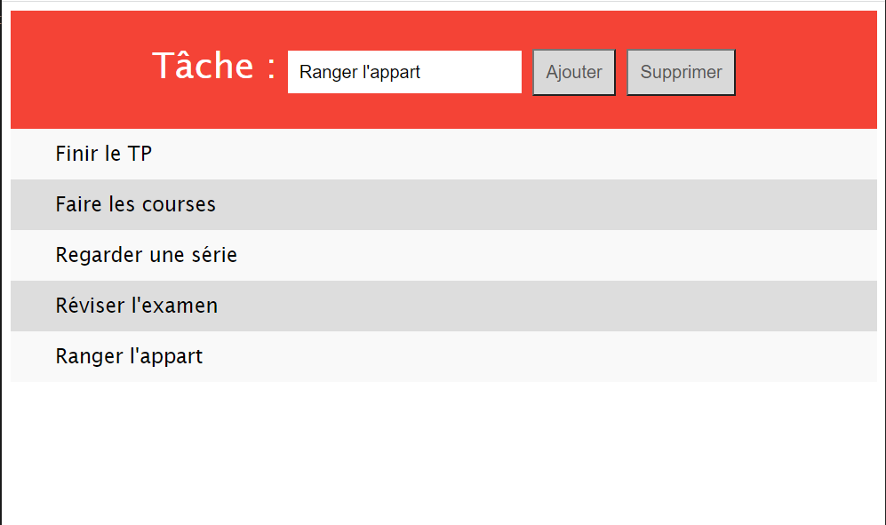

# TP TLW 3ETI (Session 2)

Ce TP est individuel et doit être rendu au plus tard le **lundi 28/02/2022 à 18:00**.

## Exercices sur HTML et JavaScript
Les exercices de cette section doivent vous permettre de reprendre en main les bases d'HTML et JavaScript. Aucune mise en forme n'est demandée dans cette section.

### Exercice 1 : manipulation du contenu de la page
Créez une page HTML contenant un paragraphe avec le texte `Hello World!` et un bouton `Traduire`. Quand on clique sur le bouton, le texte du paragraphe doit devenir `Salut tout le monde !`

### Exercice 2 : manipulation des attributs HTML
Créez une page HTML contenant l'image de l'ampoule éteinte (disponible sur le dépôt), ainsi que deux boutons `Allumer la lampe` et `Eteindre la lampe`. Un clic sur un bouton `Allumer` doit afficher l'image de l'ampoule allumer, de même pour le bouton `éteindre`.

### Exercice 3 : manipulation du CSS
Créez une page HTML contenant un court paragraphe de texte, ainsi qu'un bouton. Quand on clique sur le bouton, le texte doit s'afficher en rouge et en taille 36px.

### Exercice 4 : manipulation du DOM
Créez une page HTML contenant une liste de 4 items (respectivement `Fait`, `A faire`, `A faire`, `Fait`), et deux boutons `Afficher tâches effectuées` et `Masquer tâches effectuées`. Quand on clique sur `Masquer`, les items `Fait` doivent être masqués (et inversement quand on clique sur `Afficher`).

### Exercice 5 : manipulation de formulaire
Créez une page contenant un court formulaire composé de deux champs de texte `Nom` et `Prénom`, ainsi qu'un bouton. Quand on clique sur le bouton, un popup affiche `Bonjour *Nom*, *Prénom* ! Nous sommes le *date* et il est *heure*` (en remplaçant *Nom* et *Prénom* par ceux saisis dans le formulaire, et *date* et *heure* par la date et l'heure courantes).

### Exercice 6 : gestion d'une TODO list
Créez une page contenant un champ texte et deux boutons `Ajouter` et `Supprimer`. Le bouton `Ajouter` crée un nouvel item d'une liste avec le texte sélectionné, le bouton `Supprimer` supprime le **dernier** item de la liste.

## Exercice sur CSS
Reprenez l'exercice précédent (TODO list), et ajoutez une feuille de style permettant d'obtenir un rendu le plus proche possible de l'illustration suivante :

Vous veillerez à respecter les marges, paddings, styles de police, le style des boutons, etc. Un item sur deux de la liste doit être sur un fond gris foncé.